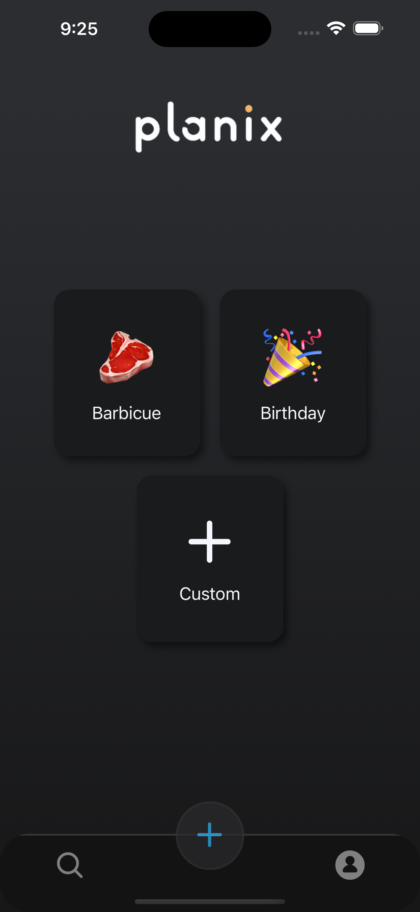

<p align="center">
  
</p>

<p>
Planix is your go-to app for effortlessly organizing any event, from birthday parties to barbecues. Designed to simplify event logistics, Planix enables you to create a group, invite members, and collaboratively manage the essentials list. Say goodbye to the hassle of planning and hello to more memorable gatherings!
</p>

## 🚀 Features

- **Create Groups Easily:** Start planning your event by creating a group for it and inviting your friends or family to join.
- **List Essentials:** Add anything and everything you need for your event to a shared list.
- **Volunteer for Tasks:** Members can freely pick items from the list to bring, ensuring everything is covered without duplicating efforts.
- **Real-Time Updates:** Get instant updates as members choose tasks, keeping everyone in the loop.

## 📲 Getting Started

1. Clone the repo
   ```sh
   git clone https://github.com/LiorZigi/Planix.git
   ```
2. Install NPM packages
   ```sh
    npm install
   ```
3. Start the application
   ```sh
   npm start
   ```

# 📸 Screenshots

<p align="center">
  
</p>

# 🔗 Links

- **API Documentation** - Detailed API documentation.
- **Project Roadmap** - Upcoming features and enhancements.
