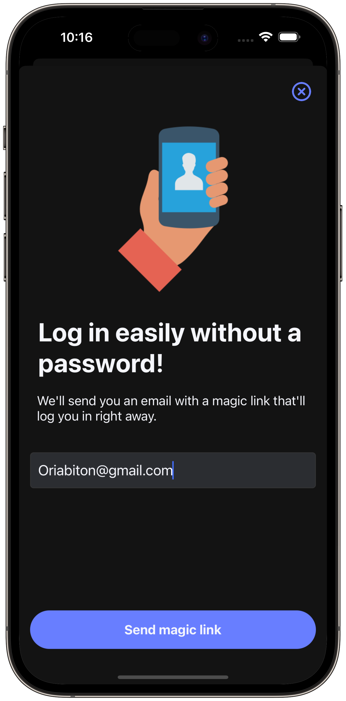
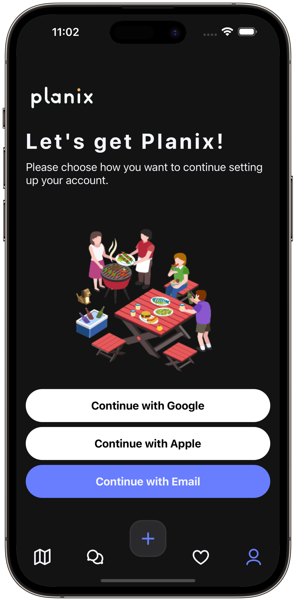
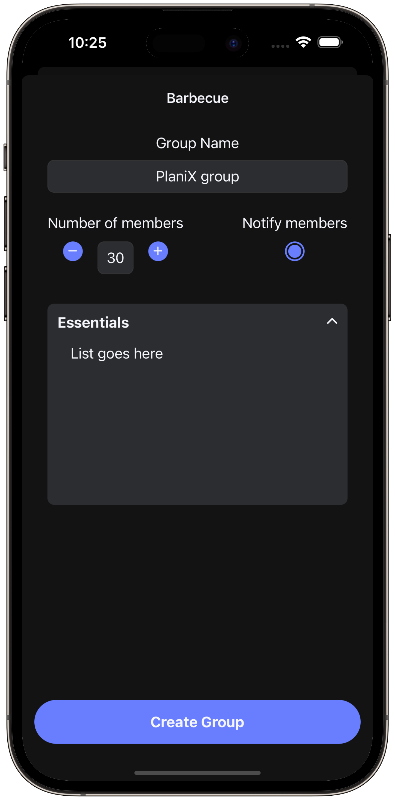

<p align="center">
  
</p>

<p>
Planix is your go-to app for effortlessly organizing any event, from birthday parties to barbecues. Designed to simplify event logistics, Planix enables you to create a group, invite members, and collaboratively manage the essentials list. Say goodbye to the hassle of planning and hello to more memorable gatherings!
</p>

## 📲  Features

- Customizable Groups - Create groups for different events with templates suggesting required essentials.
- Editable Lists - Freedom to modify members and essentials even after a group is created.
- Responsibility Tracking - Members can volunteer for essentials, which updates the list so everyone knows who’s bringing what.
- Progress Indicator - A visual percentage indicator showing how close the group is to having all essentials ready.
- Favorites - Save your favorite event setups for quick planning in the future.
- Unified Chat - Manage communications across multiple groups in one integrated chat system.
- Discover Venues - Use integrated maps to find the perfect public venues for your events.


## 🚀  Getting Started

1. Clone the repo
   ```sh
   git clone https://github.com/LiorZigi/Planix.git
   ```
2. Install NPM packages
   ```sh
    npm install
   ```
3. Start the application
   ```sh
   npm start
   ```

# 📸  Screenshots

<p align="center">
  
  
  
</p>

# 🔗  Links

- **API Documentation** - Detailed API documentation.
- **Project Roadmap** - Upcoming features and enhancements.
